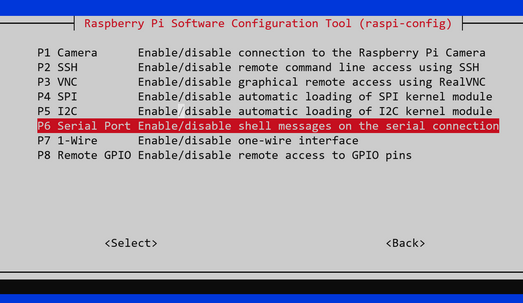

Model Predictive Control (MPC) For A Segway-like Two Wheel Robot
================================================================

- Glue code written in Python
- Control code written in C++
- Running on a Raspberry Pi, connected to an Elegoo Tumbller kit

Simulation code written in MATLAB for rapid prototyping and analysis:

BOM
---

- Raspberry Pi 3 (or similar)
- Jumper wires to connect the Raspberry Pi to the Arduino
- Elegoo Tumbller kit (https://www.amazon.de/gp/product/B07QVKPT6J/ref=ppx_yo_dt_b_asin_title_o03_s00?ie=UTF8&psc=1)
- 2x 18650 batteries
- 18650 battery shield (https://www.amazon.de/gp/product/B0822Q4VS4/ref=ppx_yo_dt_b_asin_title_o02_s00?ie=UTF8&psc=1)

A 3D printer is helpful to properly mount the Raspberry and the 18650 batteries.

Block diagram
-------------

    +-------------------------------+
    |                               |
    |  Raspberry Pi                 |
    |                               |
    |  Running high-level control   +-----------+ WiFi connection
    |  IMU sensor fusion            |
    |  Model Predictive Control     +-----------+ Dedicated battery
    |                               |             for Raspberry Pi
    |  +----------------+           |
    |  | Main program:  |           |
    |  | ctrl.py        |           |
    |  |                |           |
    |  ++--+-----+------+           |
    |   |  |     |                  |
    |   |  |     +---------------+  |
    | +-+  |     | libpynav.so   |  |
    | |    |     | Native C code |  |
    | |    |     | Kalman        |  |
    | |    |     | Filter for    |  |
    | |    |     | attitude est. |  |
    | |    |     +---------------+  |
    | | +--+----------------+       |
    | | | libctrl.so        |       |
    | | | Native C++ code   |       |
    | | | Model pred. ctrl  |       |
    | | +-------------------+       |
    | +--------+                    |
    +----------|--------------------+
               |
               | 250000 baud serial/UART connection
               | Custom simple ASCII protocol.
               |
               | To Raspberry at 50 Hz:
               |    - IMU data (accelerometer and gyroscope)
               |    - Wheel ticks (left/right)
               |
               | Read in from Raspberry Pi:
               |    - Motor setpoint speed
               |
    +----------+------------+
    |                       | I²C +----------+
    |  Arduino              +-----| IMU      |
    |                       |     +----------+
    |  Collecting sensor    |     +------------------------------------------+
    |  data and low level   +-----| Battery, Ultrasonic dist., RGB leds, ... |
    |  motor control        |     +------------------------------------------+
    +----------+-------+----+
               |       | PWM
               |       | Discretes for wheel ticks
    +----------+       +------------+
    |Motor left|       | Motor right|
    +----------+       +------------+

Prerequisites
-------------

    - Raspberry Pi has stable separate power supply
    - Raspberry Pi UART/serial port is active and login shell over serial is disabled
    - Raspberry Pi UART connect to Arduino UART pins:

        Raspberry Pi                    Arduino
        ------------                    -------
        Pin  8/GPIO14 (UART0_TXD) ----- Pin 0 (RX)
        Pin 10/GPIO15 (UART0_RXD) ----- Pin 1 (TX)

        Gnd (e.g. Pin 6)          ----- Gnd Pin

Quickstart (Linux)
------------------

Compile Arduino sketch (Arduino/lowlevel_ctrl.ino) from a normal PC with the
Arduino IDE and upload to Arduino controller.

On the Raspberry Pi: Run make to compile libctrl.so:

    make

Make sure libpynav.so is present in the root directory (external inertial sensor fusion library).

Run on the Raspberry Pi:

    python3 ctrl.py

MATLAB
------

Run simulation in MATLAB:

    MATLAB/segue.m

The MATLAB simulation has the MPC code as MATLAB .m code, but you can also
include the C++ version as .mex file: Compile the MPC module
(libctrl.dll/libctrl.so) as MATLAB .mex module from the MATLAB command line in
the src/ folder:

      >> mex -O mpcctrl_mex.cpp mpcctrl.cpp mpcgain.cpp qphild.cpp -DCL1NORM_NO_MEX cl1norm.cpp -I./

Windows
-------

Windows only partially supported. The MATLAB simulation runs out of the box on Windows,
but the Python code (ctrl.py) expects a Raspberry Pi connected to an Arduino on
an Elegoo Tumbller 2-wheel robot.

System model
-----------

  STATE SPACE MODEL
  -----------------

     4x1 state vector x of two wheel robot:

     x = [ position(m)  velocity(m/s) theta(rad)  thetadot(rad/s) ]

     u = 1x1 Wheel motor control input variable between 1.0 (max. forward
           speed) and -1.0 (max. backward speed)

     A = [0      1              0                0;
          0      f1             f2               0;
          0      0              0                1;
          0      f3             f4               0];

     B = [     0;
               b1;
               0;
               b2];

     xdot(k) = A*x(k) + B*u(k)

Raspberry Pi Serial Port Configuration
--------------------------------------

Enable and configure the serial port on the Raspberry Pi via:

    sudo raspi-config

